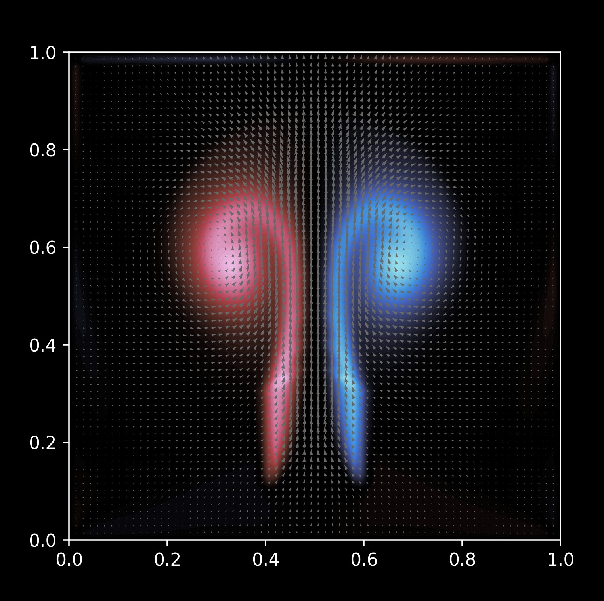

# Fluid Simulation in Python

This program is a stable fluids simulation implemented in Python.


## Getting Started

### Requirements
- Python == 3.11 recommended

### Installing
Quick setup
```
git clone https://github.com/eloidieme/fluid-sim-python.git
python -m venv .venv
. ./.venv/bin/activate
pip install -r requirements.txt
```

### Executing program
You can adjust the simulation parameters in `src/stable_fluids.py` and then run it with:
```bash
python3 src/stable_fluids.py
```

## Authors

* Eloi Dieme
Inspired by a YouTube video by Felix Koehler.
Original paper by Jos Stam (1999).